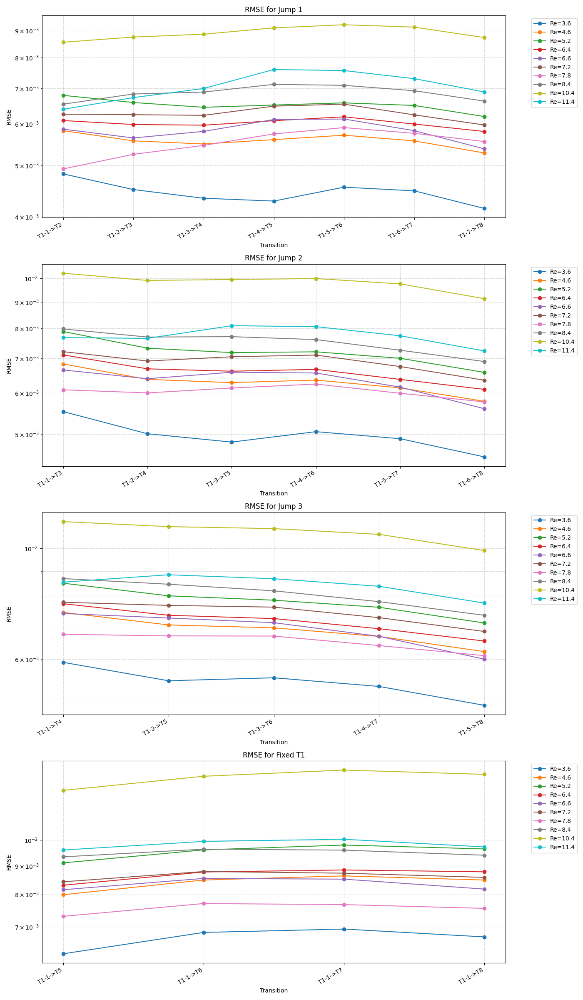
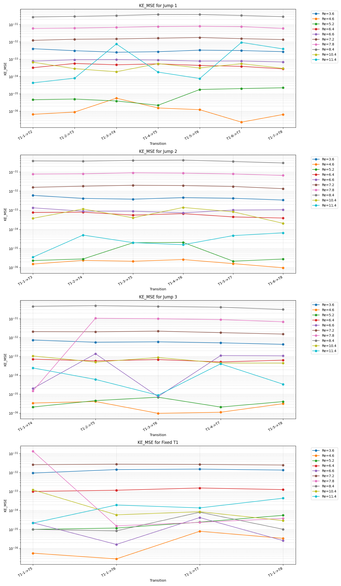

# Interpolation Physics Evaluation Summary

This document outlines the methodology and results of the "Interpolation" evaluation, which tests the model's self-consistency across diverse temporal transitions in fluid dynamics simulations.

## Overview

The evaluation focuses on the degree to which the Transformer/Autoencoder pipeline preserves physical laws when predicting future flow states from varying lengths of historical context. We test transitions with different "temporal jumps" and fixed historical context to evaluate the model's robustness to different prediction horizons and temporal gaps.

### Evaluated Transitions

The following transitions are tested for each Reynolds number:

1.  **Jump 1 ($T_i \rightarrow T_{i+1}$)**: $T_1 \rightarrow T_2, T_2 \rightarrow T_3, T_3 \rightarrow T_4, T_4 \rightarrow T_5, T_5 \rightarrow T_6, T_6 \rightarrow T_7, T_7 \rightarrow T_8$.
2.  **Jump 2 ($T_i \rightarrow T_{i+2}$)**: $T_1 \rightarrow T_3, T_2 \rightarrow T_4, T_3 \rightarrow T_5, T_4 \rightarrow T_6, T_5 \rightarrow T_7, T_6 \rightarrow T_8$.
3.  **Jump 3 ($T_i \rightarrow T_{i+3}$)**: $T_1 \rightarrow T_4, T_2 \rightarrow T_5, T_3 \rightarrow T_6, T_4 \rightarrow T_7, T_5 \rightarrow T_8$.
4.  **Fixed Context ($T_1 \rightarrow T_j$)**: $T_1 \rightarrow T_5, T_1 \rightarrow T_6, T_1 \rightarrow T_7, T_1 \rightarrow T_8$.

## Methodology

For each transition, the model is provided with ground-truth data from $T_1$ up to the end of the specified history. It then autoregressively predicts the target timestep. The predicted velocity field is reconstructed into a 3D volume to evaluate the following physical constraints:

### 1. Kinetic Energy (KE)
Measures the specific kinetic energy of the flow.
$$\text{KE} = \frac{1}{2}(u^2 + v^2 + w^2)$$
We use **PySINDy** [1, 2] to verify if the algebraic relationship between the velocity components and the calculated KE is recovered in the predicted field.

### 2. Enstrophy ($\Omega$)
Measures the intensity of vorticity in the flow, representing the "swirl" or "churn".
$$\mathbf{\omega} = \nabla \times \mathbf{u}$$
$$\Omega = \frac{1}{2}|\mathbf{\omega}|^2 = \frac{1}{2}(\omega_x^2 + \omega_y^2 + \omega_z^2)$$
PySINDy evaluates if the spatial gradients of the predicted field are physically consistent with the global enstrophy. This is a critical "stress test" for the model's ability to maintain spatial coherence across its predictions.

### 3. Helicity ($H$)
Measures the extent to which fluid flow lines wrap and twist around each other.
$$H = \mathbf{u} \cdot \mathbf{\omega} = u\omega_x + v\omega_y + w\omega_z$$
Verified via SINDy recovery of the linear combination of velocity and vorticity.

### 4. Incompressibility (Divergence)
A fundamental constraint for incompressible fluid dynamics.
$$\nabla \cdot \mathbf{u} = \frac{\partial u}{\partial x} + \frac{\partial v}{\partial y} + \frac{\partial w}{\partial z} = 0$$
We measure the **Divergence RMSE** to quantify the model's adherence to this law.

## SINDy for Physics Verification

In this analysis, we employ the **Sparse Identification of Nonlinear Dynamics (SINDy)** algorithm, specifically the **PySINDy** Python package [3]. SINDy is used to identify the underlying physical relationships within the predicted velocity fields.

### Why SINDy in Fluid Dynamics?
The application of SINDy to fluid flows has been pioneered in several landmark studies [1, 4] for several key reasons:
*   **Interpretability:** Unlike black-box neural networks, SINDy provides a parsimonious, human-readable model of the dynamics.
*   **Physics-Awareness:** By attempting to recover known physical quantities (KE, Helicity, Enstrophy) from the predicted field, we can quantify the model's "physicality" beyond simple pixel-wise error metrics.
*   **Data-Driven Discovery:** SINDy is robust to noise and can identify governing equations from limited data, making it ideal for validating complex flow structures like those generated by our Transformer model.

By using SINDy as an evaluation tool, we verify that the model hasn't just learned to minimize RMSE, but has fundamentally learned the spatial and algebraic constraints that govern fluid motion.

## Results

### Direct Error (RMSE)
Tracks the raw prediction error compared to the ground truth.

### Enstrophy Consistency
Indicates if the spatial structure (vorticity) is preserved.

### Incompressibility
Measures the violation of the $\nabla \cdot \mathbf{u} = 0$ constraint.

### Additional Physics

## References

1.  Brunton, S. L., Proctor, J. L., & Kutz, J. N. (2016). Discovering governing equations from data by sparse identification of nonlinear dynamical systems. *Proceedings of the National Academy of Sciences*, 113(15), 3932-3937.
2.  de Silva, B. M., et al. (2020). PySINDy: A Python package for the sparse identification of nonlinear dynamics. *Journal of Open Source Software*, 5(49), 2104.
3.  Loiseau, J. C., & Brunton, S. L. (2018). Constrained sparse Galerkin regression for fundamental physics of fluid dynamics. *Journal of Fluid Mechanics*, 838, 42-67.
4.  Kutz, J. N., et al. (2016). *Dynamic Mode Decomposition: Data-Driven Modeling of Complex Systems*. Society for Industrial and Applied Mathematics.

---
*Note: Detailed numerical results are saved in [interpolation_physics_results.csv](interpolation_physics_results.csv).*
