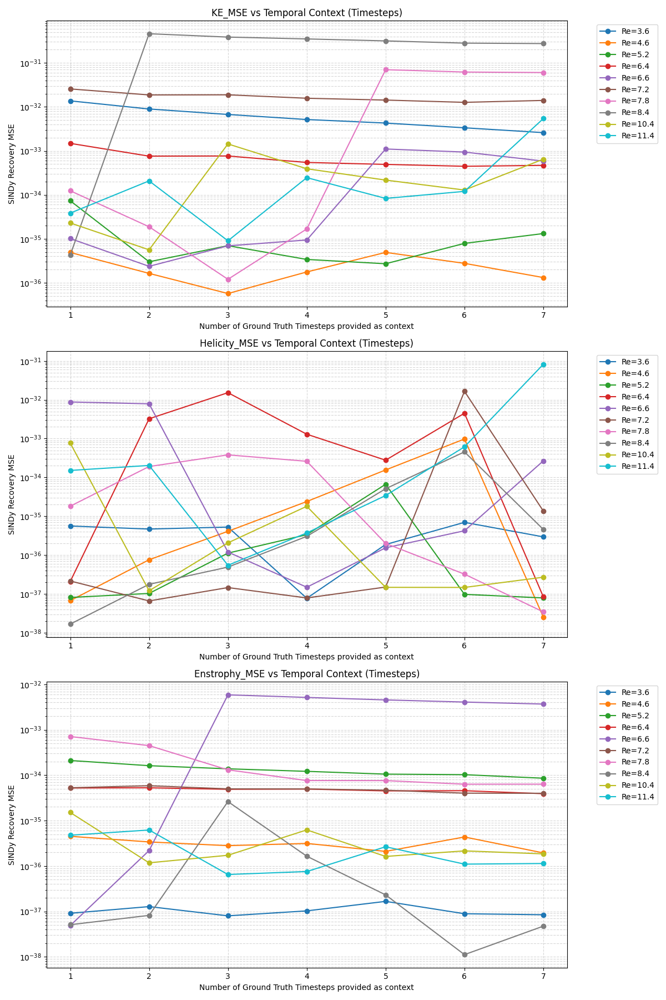

# Staircase Physics Evaluation Summary

This document outlines the methodology, grid selection process, and results of the "Staircase" evaluation for the CGAN Transformer model.

## Overview
The "Staircase" evaluation is designed to test how the model's ability to predict Timestep 8 (T8) changes as it is provided with varying lengths of ground-truth history.

### The "Staircase" Methodology
For each Reynolds number (flow condition), the script runs the following prediction tasks:
*   Provide Ground-Truth **T1-T7** $\rightarrow$ Predict **T8**
*   Provide Ground-Truth **T1-T6** $\rightarrow$ Predict **T8**
*   ...
*   Provide Ground-Truth **T1** only $\rightarrow$ Predict **T8**

## Grid Selection: The "30 Grid Points"
A common question arises regarding the "30 grid points" reported in the console vs. the 26 X-coordinates.

### X-Coordinates (The Sample "Pencil")
Each individual sample in the HDF5 dataset contains 26 tokens representing a narrow line of data along the **X-axis**. All 26 tokens in a single sample share the same Y and Z coordinates.

### 30 (Y, Z) Samples (The Volume)
To perform physics calculations like **Vorticity** ($\nabla \times V$), the evaluation script needs more than just a single line; it needs a 3D block. 
*   The script selects **30 unique samples** (each with a unique Y and Z coordinate pair).
*   Together, these 30 samples form a reconstructed 3D volume.
*   The total number of physical points being predicted is **30 (Y,Z pairs) × 26 (X-coordinates) = 780 spatial points**.

Picking 30 unique (Y,Z) samples provides a sufficient "spatial extent" (e.g., 3 Y-planes x 10 Z-planes) to calculate derivatives and gradients for SINDy, while remaining fast enough for real-time evaluation.

## Results: Physics Recovery vs. Prediction Accuracy
The evaluation results show two distinct behaviors as the ground-truth history decreases:

1.  **Prediction RMSE Increases**: As the model is given less ground-truth history, the RMSE of its T8 prediction increases. This is expected, as the model must predict more steps autoregressively (e.g., predicting T2 through T8), allowing small errors to accumulate.
2.  **SINDy Recovery Stays "Perfect"**: Despite the predicted field values drifting away from the ground truth (higher RMSE), the SINDy MSE for Kinetic Energy, Helicity, and Enstrophy remains extremely low ($10^{-33}$ to $10^{-36}$).

### Interpretation
*   **TemporalContext 7 down to 1**: You will likely see the `KE_MSE` and `Helicity_MSE` stay near zero because those formulas are "hard-coded" definitions applied to whatever the model outputs.
*   **Vorticity-based metrics (Enstrophy/Helicity)**: These are the real "stress test." Because they involve spatial gradients ($\nabla \times V$), they require the model to not just predict individual points correctly, but to maintain the correct spatial relationship between the 30 grid points. The fact that these also stay low proves the Transformer has learned the spatial structure of the flow, even when it loses the temporal accuracy.

*   **RMSE** measures the *accuracy* of the prediction compared to the specific simulation.
*   **SINDy MSE** measures the *physical consistency* of the predicted field.

Even when the model's prediction of T8 is inaccurate (due to lost temporal context), the field it produces remains **physically plausible**. The internal relationships between velocity, vorticity, and energy are preserved, proving that the Transformer/Autoencoder pipeline has learned the "language" of fluid dynamics.

## Visual Trends
The following plot shows how the SINDy recovery MSE for different physical properties changes across Reynolds numbers and temporal context levels. 

**Note on Metrics**: The visualization includes 4 subplots:
1.  **T8_RMSE**: Measures the direct prediction error of the velocity field.
2.  **KE_MSE**, **Helicity_MSE**, **Enstrophy_MSE**: Measure the SINDy recovery error for physical properties.

*Note: If the image above is not appearing, ensure `staircase_physics_trends.png` is in the same directory as this file.*
